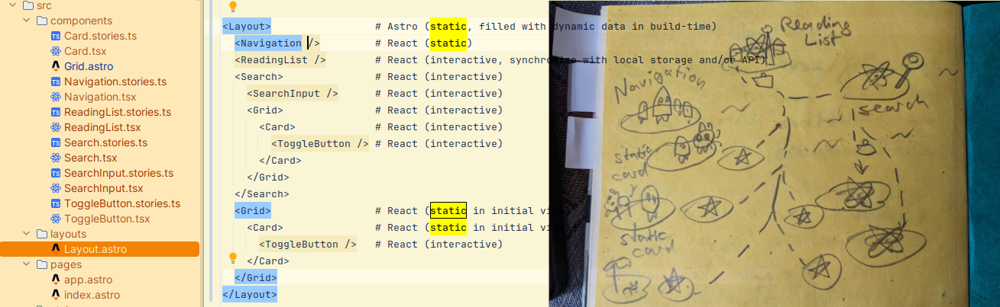
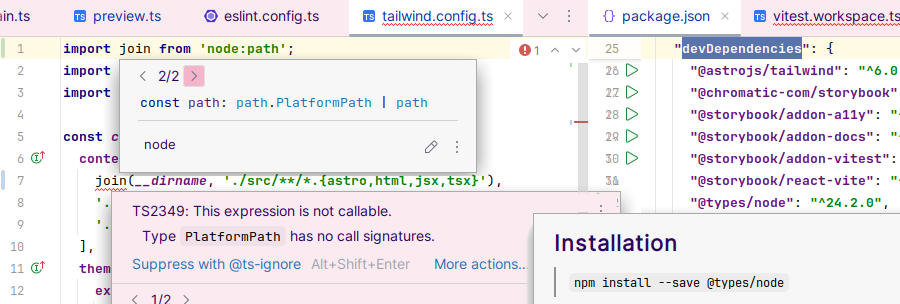

# Bookstack Reading List App Dev-UX-Lesezeichen, an Astro and React Revival Project

## Status and Demo

[](https://app.netlify.com/sites/uxdevlesezeichen/deploys) 

https://uxdevlesezeichen.netlify.app/ ✅✅

https://dev-ux-lesezeichen.de/ ✅✅

### Tech Stack:


See the [Software Architecture Research and Decisions section](#software-architecture-research-and-decisions) for more information.

### Disclaimer ⚠️

The main purpose of this code base and websites generated using this code is learning and evaluation. This is a work in progress. The code is provided as-is, without any guaranty or liability whatsoever and should be treated as private and non-production-ready. Copyrights and licences might apply. Do not reuse fonts, graphics, text, or code without explicit permission of the respective author or owner. Use the code and the website generated by this code at your own risk! Any code committed to this repository might be used and reused by Ingo Steinke (openmindculture) and their business partners unless forbidden by legal limitations.

This README file contains unfinished and incomplete notes that might be outdated.

### TODO List:

- [x] Astro + Vite + Tailwind setup
- [x] Storybook setup
- [x] global style apply to Storybook
- [ ] style class names to components: Detecting classes in source files?, see https://tailwindcss.com/docs/detecting-classes-in-source-files
- [x] second page (ongoing, branch: feature/content-demo)
- [x] content collection
- [x] to page with cards
- [ ] to JSON like API output
- [x] Storybook testing
- [ ] Vitest testing
- [ ] Storybook+Vitest testing
- [ ] Playwright end-to-end integration testing
- [ ] deploy milestone (page 2)
- [x] update blog post draft: even less details
- [x] clean up README

Theme change
- keep the new dx font, but only for the site title
- remove the Adler fallback
- use Atkinson everywhere else
- switch colors to an orange theme matching Orange Rain Light Theme and retro image both found in the DEV post draft for "An AI-Assisted Astro and React Revival Project"

## Development and Deployment

### dev server
  - `npm run dev`
  - http://localhost:4321

### build and preview
  - `npm run build`
  - `npm run preview`

### dploy to production
  - `git commit`
  - test in `develop` branch
  - merge into main branch triggers production deploy to Netlify
  - no other pushes or merges should trigger any Netlify action

### storybook
- `npm run storybook`
- http://localhost:6006/

## Requirements and Acceptance Criteria

### Non-Functional Requirements:
  - Write clean code.
  - Follow coding standards and recommendations.
    - Use Storybook.
    - Use Astro.
    - Use React.
    - Use TypeScript.
  - All tests must pass.
    - Use ESLint.
    - Use Storybook.
    - Use Vitest.
    - Use Playwright.
    - Increase test coverage.

### Description

Bookstack, also known as Dev-UX-Bookmarks or Dev-UX-Lesezeichen in German, is meant to be or become an interactive website for browsing and searching literature about UX, DevUX, web development and related topics. The website's header shows a site title and, optionally, a site search and a navigation menu. The main content between header and footer consists of the web app, that starts with a static initial view in a fixed order rendered by astro that requires no JavaScript or TypeScript. An optional interactive search uses React to replace the initial view by dynamic content showing a search result using the same visual representation as the initial view. The data about books consists of entities with title, author, ISBN, a short description, and an optional link to an authoritative source like the author's or publisher's website or a reputable online book shop. Data is presented in a modular architecture consisting of cards that take the visual shape of hexagons in a responsive layout that behaves similar, but not necessarily identical, to a flexible masonry grid card layout on Pinterest.

An optional site footer contains external links, legal notes, and additional descriptive text to help search engines and human users to better understand and find the site and its content.

### Modularity and Extensibility

Extensibility: the software architecture should follow a modular (or "atomic") approach enable the app to be extended easily without extensive refactoring by adding the following features:
- optional additional detail view: Clicking or tapping on a card should switch the display to a zoomed-in view that focuses the selected content, which should preferably be achieved using only CSS and no React, TypeScript, or JavaScript, and which might use optional animation effects when switching between views. Zoomed detail view states might use their own distinctive URLs or anchor links that, when requested, should result in the app starting with the respective view.
- optional additional permalink feature: dynamic results might use distinct URLs or anchor links. If such a link is used to access the website, it must show the matching content, in which case the static initial view might be skipped.
- optional additional reading list feature: users can bookmark or unbookmark items and make the app show a list of their bookmarked items. This should be implemented as a client-side feature without user accounts, logins, or authentication, preferably using local storage in the browser.
- optional additional suggestion or edit feature: users can suggest or add additional books to be added in the database. This might be implemented as part of the application or it might be an external process like opening a pull request or merge request in the project's Git repository.
- The web app should be designed in a way that it is easy to localize. This does not necessarily imply that there are no fixed strings or text blocks in a nonlocalized version.

#### Accessibility, Usability, Workflow Guidelines

The web app must be accessible, responsive, robust, maintainable, eco-friendly and load quickly.

- Accessibility: the web app must be accessible and responsive
  - the frontend must comply to WCAG 2.1 AAA
  - the frontend should comply to future WCAG versions
  - the frontend must pass automated audits like axe, wave, and the Lighthouse/PageSpeed Accessibility section
  - all links must be focusable and reachable using keyboard navigation
  - all text must be selectable and readable
  - animation effects must only be active unless the user prefers reduced motion
  - every image must have a meaningful alt attribute
  - content must be printable
- Robust: the app and its development process should adhere to the principles of
  - progressive enhancement
  - graceful degradation
  - robustness, i.e. if a partial function breaks or is unavailable, other parts of the application must not be affected. Initial content must be available without JavaScript.
- Maintainability
  - code should be modular and easy to read
  - code style must follow rules and recommendations defined by linter configuration
  - code style should follow official recommendations and best practices
  - code must be linted using eslint
  - code must always be syntactically correct
  - all tests must run successfully
  - npm run build must succeed
  - merge conflicts must be resolved
  - generated code must be reviewed by a human before commit and deployment
  - variables, functions, and files should use meaningful, self-explanatory names
  - JavaScript logic must be written in TypeScript.
  - Using the `any` type must be avoided.
  - Application logic code should be tested or be testable.
  - Test should strive for 100% code coverage.
  - Frontend must be tested using semantic and visual regression tests.
  - Frontend accessibility, animations, and hover states should be tested.
- Loading speed, eco-friendliness, web performance: the application should react quickly,
  - Lighthouse or PageSpeed audits should achieve an overall performance score above 80/100
  - WebsiteCarbon and Ecograder audits should prove above-average test results.
  - The initial page weight must not exceed 1 MB.
  - The web app must be fully interactive within 2 seconds after it finished loading.
- Robustness
  - follow the robustness principle,
  - prefer progressive enhancement.

Development should either be platform-agnostic or designed to work on Linux and MacOS. For example, we use `node:path` (not string concatenation) when specifying paths to files.

The app can be deployed "in the cloud" (e.g. on Netlify web services).

### Branches, Merging and Deployment Rules

The main branch, `main` is the protected branch for production-ready code. The latest commit in the main branch should be automatically deployed to the production website by an online service like Netlify, unless the automated tests have failed. Code must always be working, tested, and follow all guidelines before getting merged into the main branch. Every successful release should correspond to a git tag.

The development branch, `develop` is the current development state that should be stable enough to use it on localhost and fork new feature branches. Stable enough means that although some tests or requirements may fail, there must be a working website in the local browser after running `npm run dev`.

New features should be developed in a modular way using feature branches in a process similar, but not necessarily identical, to git flow, preferably using atomic commits and trunk-based development against the `develop` branch as the "trunk" of the development process. Feature branches must never be merged into the main branch directly.

Developers, bots, and AI agents or assistants should refer to the requirements stated in this document, in optional GitHub issues. Generally, developers and assistants should always strive to provide correct, complete, and working code and they should ask for missing project code, documentation, or definitions necessary for an adequate response, instead of guessing. AI assistants must be instructed to provide concise, complete, and correct answers to clear and simple questions, adhere to best practices and coding standards, and don't suggest counterproductive antipatterns.

In Astro, prefer native HTML elements like <head> over overengineered custom elements like <Head> unless they are necessary. Generate working code using the latest stable npm package dependencies and install all dependencies that are needed. Don't generate faulty code that you are able to fix, generate error-free code in the first place! Don't change code based on assumptions, especially if the code is currently correct, don't try to fix it.

In TypeScript, do not use the 'any' type. Do not use the non-null assertion operator (`!`). Do not cast to unknown (e.g. `as unknown as T`).  It is critically important that you adhere to the above rules.

### Importing

As Astro is the least known part of our tech stack, we should prefer more established file formats where it makes sense, and add `.astro` file suffixes explicitly when importing files into other files.

We can omit `.jsx` and `.tsx` file suffixes when importing React into Astro or other React components.

### TypeScript in React

Interfaces work much like React PropTypes, and we can use `React.FC<Props>` or `React.HTMLProps<HTMLDivElement>` if needed.

Possible typing strategies include the simple `PropsWithChildren`, the functional `React.FC` (function component) and `React.HTMLProps` suitable for dealing with HTML DOM elements.

#### React.FC (function component)

React.FC specifies a [function component](https://reactjs.org/docs/components-and-props.html#function-and-class-components) and lets us also assign a type variable. It uses PropsWithChildren behind the scenes, so we don't have to worry about connecting our Props with it.

```tsx
export interface Props {
  heading: string;
}

const PostPreview: React.FC<Props> = (props) => {
```

#### Solution 3: React.HTMLProps

The most specialized version is to extend React.HTMLProps. The HTMLProps support a variety of tags (HTMLDivElement, HTMLFormElement, HTMLInputElement, etc.). Make sure that the type variable matches the outmost tag (the first tag, that is mentioned after return). Example:

```tsx
export interface Props extends React.HTMLProps<HTMLDivElement> {
  heading: string;
}
```

Source: Typing React Props in TypeScript https://dev.to/typescripttv/typing-react-props-in-typescript-5hal

#### Types vs. Intefaces

> Always use interface for public API's definition when authoring a library or 3rd party ambient type definitions, as this allows a consumer to extend them via declaration merging if some definitions are missing.
>
> consider using type for your React Component Props and State, for consistency and because it is more constrained.
>
> Source: https://react-typescript-cheatsheet.netlify.app/docs/basic/getting-started/basic_type_example/

## React

With React 17 and later, using "the new JSX transform", also known as "the automatic runtime", explicitly specified by TypeScript `compilerOptions: jsx: react-jsx` in `tsconfig.json`, we can generally omit `import React from 'react';` in JSX and TSX files, as this implies `react/jsx-runtime` import. However, to use React APIs like hooks such as useState, or components like Suspense, those must be imported explicitly.

### JSX

JSX is not HTML, despite the similar angular brackets. Tags must be closed or self-closing, and class name attributes are called `className` (not `class`) in JSX. With TypeScript, JSX becomes TSX.

### Controlling Complexity

React and npm modules might feel like a fragile overhead, but at least it's still a more controlled and explicit way to add an manage third-party code than copy-and-paste or loading jQuery plugins from an external CDN URL, like we used to do fifteen years ago.

### Simple State Management

Even without a backend API, interactive websites tend to become complex web apps, complicated enough to run into race conditions when we don't handle event queues carefully.

Concurreny forbids naively reading and writing global `window` values. While waiting for asynchronous events, users might add or remove items from their reading list or switch their dark mode preference inconsistently in multiple open tabs.

After years of Redux, Zustand, and various other third-party add-ons, React now handles state management natively with its native built-ins like Suspense, useState and related React hooks, unless we require more complex or special scenarios.

Modern Suspense (React 18+) now supports:

Data fetching - Any promise-based data fetching
Code splitting - Dynamic imports with React.lazy()
Server-side rendering - Streaming SSR
Concurrent features - Works with concurrent rendering

## Hooked on React

React Hooks that developers should know: useCallback, useReducer, useRef, useState, useContext, useEffect, and useMemo.

### useState, useContext, useContext

useState + useContext: Perfect for simple to moderate state sharing
useReducer: For more complex state logic. Built-in Suspense: For handling async operations.


Tutorials suggested that `useMemo` doesn't always work smoothly with `useEffect` and that we must be careful to avoid unnecessary rerendering and avoid overusing `useEffect` and `useMemo`, as `useMemo` can sometimes lead to more rerenders or recalculations than expected in React components if used incorrectly, especially on first render. Now that sounds more like the React that I knew of. So, let me recap what these hooks actually mean.

### useEffect

Replacing lifecyle methods, `useEffect` is a React hook to use "effects", also known as "side effects" in computer science, that include ....

### useMemo

"Memoization" is another silly computer science term to describe something straightforward as using a variable to avoid unnecessary repeated lookups or calculations. In vanilla JS, we'd write

```js
const myPrefix = getMyPrefix();
for (let i=0; i<10; i++) {
  console.log(myPrefix, i);
}
```

What's the point of an abstract memoization system beyond the simple example above? useMemo prevents unnecessary work by caching results between renders, while `getMyPrefix()` would be called too often, for example when a component renders because
- only unrelated state changed (like a loading spinner),
- its parent re-rendered for unrelated reasons,
- the component re-rendered due to context updates.

useMemo only recalculates when its dependencies actually change.

```jsx
function UserDashboard({ users, searchTerm, isMenuOpen }) {
  // const filteredUsers = users.filter(u => u.name.includes(searchTerm));
  // ^ without useMemo, this would run too often!

  // only run when users or searchTerm changed:
  const memoizedUsers = useMemo(() =>
    users.filter(u => u.name.includes(searchTerm)),
    [users, searchTerm]
  );

  return (
    <div>
      <Menu isOpen={isMenuOpen} /> {/* State change here... */}
      <UserList users={memoizedUsers} /> {/* ...doesn't trigger filtering */}
    </div>
  );
}
```

### useRef

I remember "forward refs" as another concept I struggled to get into my head. (what was the point of "why can't we just ..." - what?) is this something only relevant with react router?

Regarding useRef - no, it's not specific to SPA routing at all. useRef is a core React hook that serves two main purposes:

Accessing DOM elements directly - when you need to imperatively interact with DOM nodes (focus an input, scroll to an element, measure dimensions, etc.)
Persisting mutable values across renders - storing values that don't trigger re-renders when they change, unlike useState

## React Router for not-so-single page applications

React Router remains the most popular and widely-used routing library for React applications. The routing-specific hooks in React Router are things like useParams, useLocation, useSearchParams, and  useNavigate() (replacing useHistory())

### useNavigate

TODO ...

## Web Forms

What happened to React-Select dropdowns and controlled input? Does React still use a virtual DOM when Preact can do without? What's the best practice to handle web forms and user input with React 19 in 2025?

- "controlled input" (state as single source of truth, rerender after typing) is still popular and recommended, unless we prefer full accessible HTML5-style web form control (I do)

## daisyUI Tailwind Plugin

[Daisy](https://daisyui.com/) is a pure CSS plugin adding style presets like button classes and form elements to Tailwind.

Tailwind v3 (required by Astro 5.12) implies daisyUI v4 (not the latest v5).

## Tailwind Playground Online

like codepen, e.g. https://play.tailwindcss.com/L2yalFmJcY

## More Tailwind Takeaways and Learning Notes

unpublished blog post draft:
[doc/An Astro React Revival Project and its Tailwind Takeaways - DEV Community.PDF](doc/An%20Astro%20React%20Revival%20Project%20and%20its%20Tailwind%20Takeaways%20-%20DEV%20Community.pdf)

## Testing and Development Tech Stack Choices

### Integrating Storybook, React, and Astro

Storybook is framework-agnostic. Stories can be used by React and Astro (which can render React components), The core logic and styling of the component should ideally be independent of any specific framework's internal mechanisms. he component should rely on props for its data and behavior. This makes it easy to pass information from Astro (when using the React integration) or from other React components.

#### Inverse integration

Storybook can't understand Astro, but Astro can render TSX to static HTML, so we can just write any component in TSX. If we don't specify any `client:` directive, Astro will render React components to static HTML without any interactive JavaScript.

However, we can use Astro's collection files and front matter to pass data to our components, whether static (React, Astro) or interactive. But before you start to rewrite every static Astro component to React, pause and think twice - there's a catch that I'll explain in the interactivity section:

Astro ideally lets us focus on markup and don't use JSX and typed properties where plain HTML and (Tailwind) CSS, or content-focused markdown is more appropriate.

However, while emitting performance-optimized frontend code and markup as intended, my source still becomes 90% React and 10% Astro due to my decision to use Storybook to test and preview my components. Maybe that's the catch: something simple enough for static rendering doesn't need Storybook's interactive "play" functionality, when it will be end-to-end-tested as part of the rendered application.

How can we restrict interactivity to the smallest possible entities to profit from speed and performance of Astro's static rendering? Let's say, we have a set of cards, and each card has a star-shaped favorite button. In the initial view, the buttons are the only elements that need to be interactive. Consequentially, the favorited status can't be part of the card's state, but rather the toggle's state.

To ensure a component can be rendered statically, all interactive code must either be defined on a child compoents' level, or as global app functionality to prevent code duplication and make the components easier to read and maintain.

<Layout>                 # Astro (static, filled with dynamic data in build-time)
  <Navigation />         # React (static)
  <ReadingList />        # React (interactive, synchronize with local storage and/or API)
  <Search>               # React (interactive)
    <SearchInput />      # React (interactive)
    <Grid>               # React (interactive)
      <Card>             # React (interactive)
        <ToggleButton /> # React (interactive)
      </Card>
    </Grid>
  </Search>
  <Grid>                 # React (static in initial view with partial content)
    <Card>               # React (static in initial view)
      <ToggleButton />   # React (interactive)
    </Card>
  </Grid>
</Layout>

<JsonWrapper>            # initial Grid content rendered to JSON as a "mock API" for React search
  <JsonGrid />           # dto. (static)
</JsonWrapper>

This is essential for understanding the power of an Islands Architecture: how to make specific React elements to interact with their grandparents and global state elements? To put it another way, to stick with the image of the island landscape, how to establish ferryboat routes between interactive islands without disturbing the static ones that we could imagine as no-go-zones, possibly inhabited by cute, endangered, animals.

That's not even an Astro-specific problem, but a common challenge of classic React applications: How to avoid property drill down by using global state and a global data store? The idea of context is exactly that - for you to be able to share updateable state to the descendants without having to pass it from component to component.




#### How to read from Astro content collection files?

...

#### How to validate Astro data with imported TypeScript interface?

...

#### Storybook for React

Storybook's official "Intro to Storybook for React" tutorial uses a `Task` component as a core example:

- https://storybook.js.org/tutorials/intro-to-storybook/react/en/simple-component/
- https://fantinel.dev/blog/storybook-astro-svelte

As a standalone tool alongside an app, Storybook defines stories according to the Component Story Format (CSF), an ES6 module-based standard that is easy to write and portable between tools.

`npm run storybook` starts a Storybook server and opens localhost:6006 in a browser to render all components configured in our `.storybook` directory. The `react-vite` framework and the `vitest` and `a11y` addons promise a seamless integration.

### Integrating Storybook, Vite, and Tailwind 3 🐇🕳️

According to the official documentation, integrating Tailwind and Storybook should be as easy as adding `import '../src/styles/global.css';` to our `.storybook/preview.ts` and [configure PostCSS](https://storybook.js.org/recipes/tailwindcss#1-configure-postcss). However, this approach silently failed without any error message or debug details when using Astro 5, Astro-Tailwind 6, Storybook-React-Vite 9, and Tailwind 3.3 together with PostCSS 8, as an implicit peer dependency of all of Astro, React, and Tailwind, as `npm list postcss` tells us.

Before asking myself in which project I could possibly open a GitHub issue, or how to provide a minimal reproducible example for asking on StackOverflow, let's double-check documentation, matching versions, and add the missing explicit PostCSS cconfiguration that we didn't need for Astro, Vite, and Tailwind working together well and applying my customized global Tailwind CSS style file in the interactive preview server started with `npm run dev`.

Double-checking step by step:

The path to `global.css` is correct. Changing it to a project-rooted `/src/styles/global.css` doesn't change anything. Specifying a nonexistant paht like `src/global.css` throws a fatal errror.

To make sure that `.storybook/preview.ts` isn't just checked but really used, I added a `console.log('storybook preview ts executed');` below the import. Its output shows in my browser console.

It is correct to use Tailwind 3 (not Tailwind 4) with Astro 5, and all of our libraries use the same PostCSS version without explicit pinning. Tailwind 3.3 is the latest stable Tailwind 3 release. Astro and Vite are up to date as well.

The documentation implies that for integrating Tailwind's PostCSS compilation, when using Vite, we can simply skip to the next step, and, in case of a failing Webpack configuration scripts, for manual configuration instructions for PostCSS, you can refer to the documentation here.

Summary and follow-up discussion: [Integrating Astro 5, Storybook 9, Vite 7, and Tailwind 3 🐇🕳️](https://dev.to/ingosteinke/integrating-astro-5-storybook-9-vite-7-and-tailwind-3-54ja)

We need to import our `global.css` explicitly in our Storybook preview configuration. And we need to fix/workaround the path definitions in `tailwind.config.js` to make it work with Storybook.

And we need `@types/node` as a  `devDependency` and we should import `path` (not `join`) and call `path.join` to prevent a fatal TypeScript error due to an ambiguous `path = path | PlatformPath`.

#### Type PlatformPath has no call signatures 🤷



TS2349: This expression is not callable. Type `PlatformPath` has no call signatures.

I found a solution thanks to this [tailwindcss GitHub issue](https://github.com/tailwindlabs/tailwindcss/discussions/16809), that [storybook GitHub issue](https://github.com/storybookjs/storybook/discussions/26323) and at least another hour of Googling and asking Claude "how to use `join` from `node:path` in TypeScript without getting Type PlatformPath has no call signatures?"

```js
// .storybook/preview.ts
import type { Preview } from '@storybook/react-vite'
import '../src/styles/global.css';
```

```js
// tailwind.config.ts
import path from 'node:path';
import defaultTheme from 'tailwindcss/defaultTheme';
import type { Config } from 'tailwindcss';

const config: Config = {
  content: [
    path.join(__dirname, './src/**/*.{astro,html,jsx,tsx}'),
    // repeat: prepend join(__dirname to every content entry
```

With the above configuration, Storybooks throws no errors, but it still doesn't apply the styles, that work well in the built application and in Astro's (Vite) preview server. Running with `--loglevel verbose --debug` produced no further helpful information.

Storybook is great when it eventually works with our project configuration, and apart from manual testing, we can even use it to easily add visual regression tests.

### How to implement frontend testing with Vitest, Storybook, and Playwright?

Storybook integrated its experimental Vitest addon into the main project, to test our components' JavaScript/TypeScript logic with Vitest.

This project, the Bookstack Reading List App showcased at Dev-UX-Lesezeichen.de, aims to combine a handful of modern frontend web development tools, notably Astro, Tailwind, React, Storybook, Vite, Vitest, and Playwright, preferably coding in TypeScript, applying descriptive declarations, and using test-driven development when possible.

- Static Analysis (ESLint)
- Unit tests (Vitest)
- Component tests (Storybook)
- End-to-end tests (Playwright)
- Visual Tests (Vitest)

### From Storyshots to Playwright to Vitest 🎭

When I was about to use Storybook Test Runner as the recommended replacement for the deprecated Storyshots tool (as an alternative to the cloud-only Chromatic), hoping for synergies with my Playwright-based end-to-end integration tests, I learned that Storybook Test Runner has been superseded by the Vitest addon.

Vitest is good at testing Astro components when using Astro's `getViteConfig()` helper in our `vitest.config.ts.todo`. Vitest can test JavaScript logic contained in `.mdx` files, while ESLint uses Remark to validate markdown syntax, when we use

- `eslint-plugin-astro`
- `eslint-plugin-mdx`

in our ESLint configuration.

### Why do we recommend Vitest Browser Mode?

Why doesn't anyone write unit tests? One of the core issues is that tests typically run in CI in a node.js environment, rather than the code’s actual target environment, the browser. Vitest's browser mode, although currently under development, and APIs may change in the future, runs your tests in a real browser (Chromium, via **Playwright**, in the default configuration). The alternative is a simulated browser environment, like JSDom or HappyDom, which can have differences in behavior compared to a real browser. This allows to run your tests in the browser natively, providing access to browser globals like window and document, and use Playwright for cross-browser testing.

Sources:
-  https://storybook.js.org/docs/writing-tests/integrations/vitest-addon#why-do-we-recommend-browser-mode
- https://www.defined.net/blog/modern-frontend-testing/

## Background: Motivation and History

The article [Building a Reading List web app with Node, Preact, and Tailwind CSS](https://dev.to/ingosteinke/building-a-reading-list-web-app-with-node-preact-and-tailwind-css-44pa) elaborates on my motivation and project history.

This should have been the first project based on my [Tailwind-JIT-MERN-Starter](https://github.com/openmindculture/tailwind-jit-mern),
which was forked from [Retinafunk's Tailwind-JIT-Starter](https://github.com/retinafunk/tailwind-jit).

[I](https://www.ingo-steinke.com/) migrated it to a simpler proof of concept demo using Astro in 2024 using the Astro Starter Kit and current documentation and tutorials. Development stopped shortly after, due to prioritized paid customer projects. Proceeding in June 2025, inspired by the React Berlin Meetup, Hunor Márton´s Astro+React talk, feedback from Freelance Unlocked workshops and AI-assisted "CV hacking" sessions, as well as feedback from fellow developers about the latest advances in AI-assisted coding, the development process and tech stack changed, once again, but only slightly, to Astro + React + Storybook + Tailwind + Vite + Vitest + Playwright, a clear frontend focus with no backend logic like dynamic API, database or serverless functions at all, and including LLM-based coding assistants like Copilot, Windsurf, Gemini, and Jetbrains AI, which is still the preferred AI assistant due to its stability and long-term development by a reputable European company.

## Roadmap
- [x] start initial proof of concept
- [x] document ideas and roadmap
- [x] register domain
- [x] release placeholder text with backlinks
- [x] update requirements and prioritization
  - [x] no backend, 100% focus on the front-end
  - [x] Tailwind without optional extras
  - [x] React (keep it simple and stick to the mainstream)
  - [x] Astro
  - [x] Playwright
- [x] release a minimal viable product/page (MVP)
- [x] research, experiment, and decide on a tech stack
- [x] document requirements and guidelines
- [ ] run audits and document results (Lighthouse, WAVE, WebPageTest, WebsiteCarbon, Green Web Check, and optional services Domain Authority, SEObility, Ubersuggest etc.)
- [ ] list and link the web app to increase incoming backlinks
- [ ] increase test coverage
  - [ ] unit tests
  - [ ] end-to-end tests
  - [ ] frontend tests, including Screenshots and accessibility audits
- [ ] localize app (German and English)
- [ ] add more content

<a id="software-architecture-research-and-decisions"></a>
## Software Architecture Research and Decisions

### Common Modules for Astro, React, and Storybook

> In an Astro project, how can we ensure that the same components can be prototyped and testing in storybook and reused both for static Astro rendering and as part of a dynamic react app?

Seasoned astronaut:

> 🧑‍🚀 Delete this section. Have fun!

### Project Structure

Inside of your Astro project, you'll see the following folders and files:

```text
/
├── public/
├── src/
│   └── pages/
│       └── index.astro
└── package.json
```

Astro looks for `.astro` or `.md` files in the `src/pages/` directory. Each page is exposed as a route based on its file name.

There's nothing special about `src/components/`, but that's where we like to put any Astro/React/Vue/Svelte/Preact components.

Any static assets, like images, can be placed in the `public/` directory.

### 🧞 Astro´s Basic Commands

All commands are run from the root of the project, from a terminal:

| Command                   | Action                                           |
| :------------------------ | :----------------------------------------------- |
| `npm install`             | Installs dependencies                            |
| `npm run dev`             | Starts local dev server at `localhost:4321`      |
| `npm run build`           | Build your production site to `./dist/`          |
| `npm run preview`         | Preview your build locally, before deploying     |
| `npm run astro ...`       | Run CLI commands like `astro add`, `astro check` |
| `npm run astro -- --help` | Get help using the Astro CLI                     |

### Additional node package scripts

`npm run test` | run all tests
`npm run eslint` | check TypeScript and JS files for correct syntax and best practices

### Editor setup

This project defines code style and syntax rules, although some specific configuration files follow their own style and syntax that we should not change.

- [.editorconfig](.editorconfig)
- [.prettierrc.json](.prettierrc.json)
- [.stylelintrc.json](.stylelintrc.json)
- [astro.config.ts](astro.config.ts)
- [eslint.config.ts](eslint.config.ts)
- [tailwind.config.ts](tailwind.config.ts)
- [tsconfig.json](tsconfig.json)
- [vitest.config.ts](vitest.config.ts)

For full IDE coding support,
- install Astro and MDX IDE plugins/extension or use the `@mdx-js/language-server` npm module;
- install `eslint-plugin-astro` and `eslint-plugin-mdx`;
- configure TypeScript support to prevent expecting TS syntax in JS files in IDE settings if necessary.

If an IDE like JetBrains WebStorm applies TypeScript syntax checking or inspections to JavaScript (`.js`) files, this behavior might be controlled by WebStorm's language service settings, but `tsconfig.json` is the correct place for TypeScript-related settings. Any IDE-specific inspection scopes and ingore patterns should be removed as they are neither necessary nor gauaranteed to work.

- disable TypeScript inspections on JavaScript files:
  - in WebStorm go to Preferences/Settings →  Appearance & Behavior → Scopes and reate a custom scope that excludes all `.js` files.
  - in WebStorm: go to Preferences/Settings →  Editor → Inspections to apply this scope to the TypeScript inspections setting the severity for that scope to "No highlighting".
  - make sure your custom scope with the "No highlighting" severity is at the top of the scope list. The IDE processes scopes from top to bottom, and the first matching scope's rules are applied.

- configure `allowJs` in `tsconfig.json`:
You can control whether TypeScript treats JS files within your project by the top-level `allowJs` configuration option. Counterintuitively, setting `"allowJs": false` in your `tsconfig.json` does not disallow using any `.js` files in our project, it only disallows (or at least promieses to reduce) TypeScript processing and checking on `.js` files.

- exclude certain files or folders from TypeScript service in `tsconfig.json`: use the "exclude" array to tell TypeScript to ignore files/folders (like build outputs or config files you don’t want checked). This prevents those files from being parsed.

While none of the above is still not guaranteed to prevent an IDE from nagging about valid syntax, it will at least reduce the severity to warning levels and prevent false positive error messages.

### Build Tools: npm vs. yarn vs. bun vs. ...

> Should we use yarn instead of npm in a project with astro, vite, and react?

For most projects and teams, **npm is a perfectly solid choice**. It's the default, well-understood, and has improved immensely. Consider Yarn, especially Yarn Berry, if you are working in a monorepo and want robust workspace support. Consider pnpm if disk space efficiency is a major concern. Consider Bun if you are starting a new project and you're ready to experiment with a fast, cutting edge tool, that is probably less stable and mature than Yarn or npm. Once you decide (or confirm) the package manager to use, always commit the corresponding lock file.

### Vite vs. Parcel vs. Webpack vs. Snowpack vs. ...

**Vite** heavily leverages esbuild, but it's not built entirely on top of esbuild in the sense that esbuild handles everything. Vite uses esbuild for specific, performance-critical tasks, and combines it with other tools for a complete development and build experience.

**Vite uses esbuild as a transpiler and pre-bundler** during development and for minification, but **relies on Rollup for the more complex production bundling** and its extensive plugin ecosystem. The eventual **plan is to consolidate these roles with Rolldown**.

### Tailwind Takeaways

There is a "Tailwind look and feel" defined by Tailwind's default styles and presets, some of which resemble the Bootstrap framework. **Tailwind's philosophy is to provide sensible defaults and utility classes that lead to good design.**

Quoting my original 2021 notes:

#### Properly Using Conditional Class Names

How to make sure to write dynamic / conditional styles in a detectable way?

So we must avoid string concatenation to create class names. For example `<div class="text-{{ error ? 'red' : 'green' }}-600">` fails to expose the class names to the purge algorithm, thus `.text-red-600 and .text-green-600` will be missing in the exported style sheets unless they are used somewhere else by coincidence.

On the other hand, writing the full class names still allows us to use conditional class names:

```
<div class="{{  error  ?  'text-red-600'  :  'text-green-600'  }}"></div>
```

In React, `class` becomes `className` according to the HTMLElement DOM specification.

```
<div className="{{  error  ?  'text-red-600'  :  'text-green-600'  }}"></div>
```

We also want to load CSS in HTML `<head>`, not in JavaScript: this might unblock load speed by allowing parallel download of CSS and JavaScript, and it also allows us to define styled static page elements outside of our (p)react app, like a footer with links to external or static resources.

#### Linting Tailwind CSS

Tailwind supports writing and using pure CSS that linters can analyze better than the JSX-in-CSS chaos often found in React projects. JIT is now standard, compiling custom CSS to prevent exporting rules that are never used.

#### Built-in Preset Class Names

Tailwind's built-in classes follow different schemas. Its numbers and letters do not imply mathematical accuracy, e.g. `2xl` is not "two times L" or "two times anything". The presence of "8xl" does not imply there is "9xl". Unsuffixed numbers and names are not supposed to be consistent between different contexts, but consistents within the same context, e.g. `text-8xl` is larger than `text-7xl`.

- `mt-4 = margin: 1rem 0 0 0` (when no other `m...` class is present)

#### Tailwind Color Palette

Every color in the default palette includes 11 steps, with 50 being the lightest, and 950 being the darkest. Use color utilities like `bg-white`, `border-pink-300`, and `text-gray-950` to set the different color properties of elements in your design. You can adjust the opacity of a color using syntax like `bg-black/75`, where `75` sets the alpha channel of the color to 75%.

A full list of utilities that use your color palette: https://tailwindcss.com/docs/colors#using-color-utilities

Also consider https://hextotailwind.com/ to find approximate matches of Tailwind built-ins.

#### Typography

Leading, in typography, is pronounced “ledding” and refers to the space between lines of text. Tailwind's `text`-prefixed properties set typography and foreground colors. Tailwind's `text-xl` is only `1.25rem`, not really "extra-large". Tailwind has defaults of `text-6xl` and  `text-7xl`, but no `6.5 / 4rem` in between.

- `leading-none = line-height: 1`
- `leading-<number>
line-height: calc(var(--spacing) * <number>)`
- `text-8xl/1 sets both font-size and line-height`
- `leading-[<value>]
line-height: <value>;`

Custom font families must be defined both in `global.css` (`@font-face` rules) and in `tailwind.config.ts` (`theme.extend.fontFamily`).

#### Customizing Tailwind CSS v3

Tailwind can be customized by adding individual classes. In Tailwind CSS v3 this is done in WordPress-like JSON syntax to extend the `theme.extend` configuration object, while Tailwind CSS v4 prefers setting custom properties in `global.css`. A so-called "Tailwind language server" helps IDEs like WebStorm, VSCode, Intellisense, to get auto-completion suggestions correct and show implied `rem` and `px` values.

Extending Taiwlwind's configuration object implicitly creates custom properties like `--color-foo` and sets of CSS rules and class names, like `text-foo` (foreground) and `bg-foo` (background) color classes, `text-clamp-10ch` for a `theme.extend.fontSize.clamp-10ch` configuration key.

Custom `fontSize` classes are prefixed with `text-`, but custom `fontFamily` keys create `font-` classes.

A color configuration object will create color variations with the respective suffixes, like `theme.extend.colors.tahiti.light` implies `text-tahiti { color: var(--color-tahiti-light); }` while `theme.extend.colors.tahiti.DEFAULT` will create a `tahiti` color without a suffix.

#### Customizing Tailwind CSS v4

In Tailwind CSS v4 (alpha/beta, not recommended for astro yet) we would define custom properties in `global.css`:

```css
    @theme {
        --color-my-custom-blue: #1a73e8;
```

#### At-Apply-Rules

We should use Tailwind's at-rule `@apply` to style globals and often-used style combinations to keep our HTML markup clean and maintainable.

So, instead of `<h1 class="font-bold break-words m-0 mt-4 leading-none color-blue-400 text-customfont">' we could use `<h1 class="custom-heading-h1">` or even just `<h1>` with global CSS like below.

```css
h1, .custom-heading-h1 {
  @apply font-bold break-words m-0 mt-4 leading-none color-blue-400 text-customfont;
}
```

Another challenge, or maybe rather an overambitious micro-optimization, is the decision where to put SVG icons that change their stroke or fill appearance to indicate state change. As I decided to use Tailwind to prevent wasting time reinventing the CSS wheel, there should be a Tailwind best-practice way to do it.

#### (Tailwind) CSS Status Icons Best Practice

Use SVG elements, not CSS data-urls, use fill and stroke class names like `<svg class="fill-current text-green-500">`.

To prevent duplication in code or frontend, use SVG symbols, supported in all relevant browsers for many years:

```html
<svg style="diplay:none">
  <symbol id="status-symbol" viewBox="20 20 20 20" ...><!-- just like an SVG element --></symbol>
</svg>

reuse 100x:
<svg class="w-6 h-6 fill-current text-green-500"></svg>
```

#### Custom Class Names in Tailwind

Prefix your class names, and avoid generic abbreviations to prevent namespace collisions with built-in classes.

### Tech Stack Diversity

At least there is no need to try to connect incompatible CJS (legacy CommonJS) `require` with EJS (ES6+ JS module or mjs) `import` and `export` syntax. **TypeScript** has saved us from React PropTypes, and **Vite** from incomprehensible Webpack configuration. Still, it can take days to screw together a project's tech stack. Still, some islands require an old syntax, like `postcss.config.cjs` or `.astro/content-modules.mjs`. We don't need to rewrite every line of code to TypeScript and that would even break some of our tools.

### Astro + React Integration

- use the `client:load` directive

```
---
import List from './List';
---
<List client:load />
```

We don't need to add `.jsx` or `.tsx` but we should add `.astro` when importing from files.

- trigger hydration only when visible using [client:visible](https://docs.astro.build/en/reference/directives-reference/#clientvisible) with an optional margin (treshold) without needing to write boilerplate code for the implicit `IntersectionObserver`

```
client:visible={{rootMargin: '200px'}}
```

Astro allows use to combine different languages and content types in a single file, keeping together what belongs together in terms of content, forget about **seperation of concerns**, and let Astro's implicit "magic" work on it. This mix risks to become dangerously unmaintainable once it gets too complex, and future syntax changes make it feel less intuitive that it was at the time of writing.

### Separation of Concerns

Are new file formats like `.astro` or `.mdx`, a lenient combination of markdown and JSX properly inspectable by static code analysis (like ESLint) and unit tests (like with Vitest). How can our project structure and code style make it easier for linters and code reviewers to find errors and antipatterns in our Astro code?

Vitest is good at testing Astro components when using Astro's `getViteConfig()` helper in our `vitest.config.ts.todo`. Vitest can test the JavaScript logic contained in `.mdx` files, while ESLint uses Remark to validate the markdown syntax, when we use

- `eslint-plugin-astro`
- `eslint-plugin-mdx`

in our ESLint configuration.

We don't need to separate language syntax, when seemingly mixed languages like 'TSX' do have a clear definition and documentation. But we whould separate responsibilities and break our code into small components that are easy to read, test, and maintain.

Reducing (JS/React-controlled) interactivity to the minimum respects

- the **Islands Architecture** approach
- the **principle of least power**
- progressive enhancement
- web performance

and improves

- load time
- user experience
- maintainability

### Astro: Robust Linting and Formatting Setup:

ESLint with Plugins:

Install and configure eslint-plugin-astro, eslint-plugin-mdx, and @typescript-eslint/parser (if using TypeScript).

Integrate Prettier (using prettier-plugin-astro and eslint-config-prettier) to handle code formatting automatically. This eliminates stylistic debates in code reviews.

Enable recommended rule sets (e.g., plugin:astro/recommended, plugin:mdx/recommended).

@typescript-eslint/parser

**TODO** check and verify, as detailed tips like that seemed to contradict when I last tried?

## Further Reading

https://docs.astro.build/en/guides/styling/#tailwind

https://docs.astro.build/en/guides/integrations-guide/react/

https://eslint.org/docs/latest/use/configure/migration-guide#custom-parsers

https://github.com/storybookjs/storybook/discussions/24835

https://github.com/storybookjs/storybook/discussions/28386

https://storybook.js.org/docs/writing-tests/integrations/vitest-addon

https://tailwindcss.com/docs/font-family

https://docs.astro.build/en/reference/configuration-reference/

https://docs.astro.build/en/guides/typescript/

